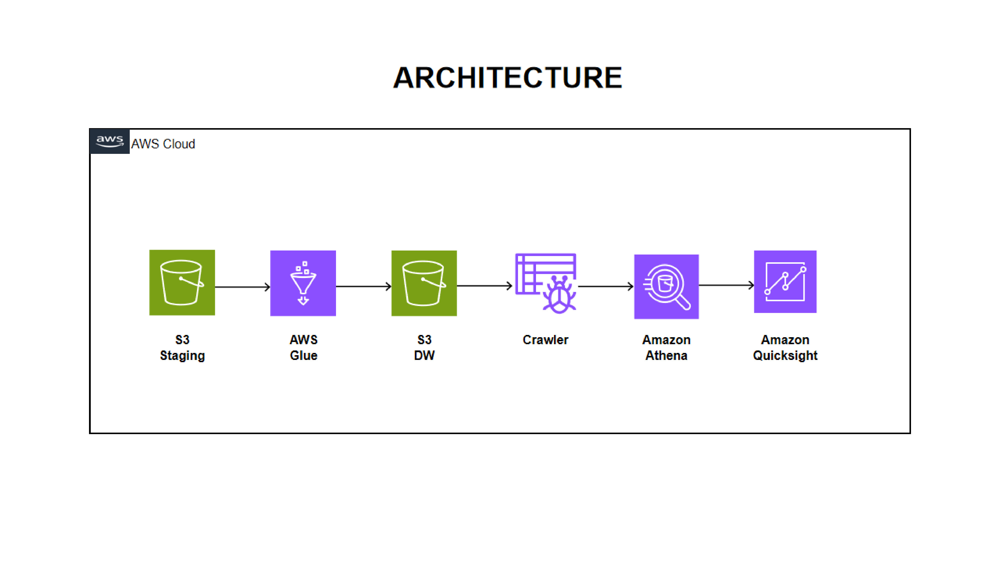

# aws-spotify-etl-project

This project analyzes the Spotify dataset, which includes CSV files containing information about albums, artists, and tracks. The pipeline involves utilizing various AWS services to process, store, and visualize the data.

## Dataset Information

The dataset comprises the following files:

- **albums.csv**: Contains information about albums, including track names, album names, release dates, labels, and popularity.
- **artists.csv**: Provides details about artists, such as artist names, popularity, genres, and follower counts.
- **tracks.csv**: Includes data on individual tracks, including track IDs, popularity scores, and explicit content indicators.

1. **Data Ingestion**: Uploading the dataset to Amazon S3 for storage.
2. **ETL Process**: Extracting, transforming, and loading the data using AWS Glue.
3. **Data Warehouse**: Storing the transformed data in S3 for data warehousing.
4. **Data Catalog**: Creating a data catalog in AWS Glue to organize the data.
5. **Crawler**: Running a crawler in AWS Glue to populate the data catalog.
6. **Data Analysis**: Querying the data catalog using Amazon Athena.
7. **Visualization**: Visualizing the results using Amazon QuickSight.

## AWS Setup

### 1. S3 Staging to Glue

- Upload the Spotify dataset (albums.csv, artists.csv, tracks.csv) to an S3 bucket.
- Create an AWS Glue job to extract the data from S3, perform transformations, and load it into a temporary staging area.

### 2. Glue to S3 Data Warehouse

- Modify the Glue job to store the transformed data into a separate S3 bucket, designated as the data warehouse.

### 3. Data Warehouse to Crawler

- Configure an AWS Glue crawler to crawl the data in the S3 data warehouse bucket.
- Run the crawler to catalog the data and create metadata tables in the Glue Data Catalog.

### 4. Crawler to Athena

- Use Amazon Athena to query the tables created by the Glue crawler.
- Write SQL queries to perform data analysis and extract insights from the dataset.

### 5. Athena to QuickSight

- Connect Amazon QuickSight to Amazon Athena to visualize the query results.
- Create dashboards and visualizations to present the analysis findings.

## Architecture

## Contact

Email: [phanirajbitti@gmail.com](mailto:phanirajbitti@gmail.com)
GitHub: [PhaniRajBitti8](https://github.com/PhaniRajBitti8)
